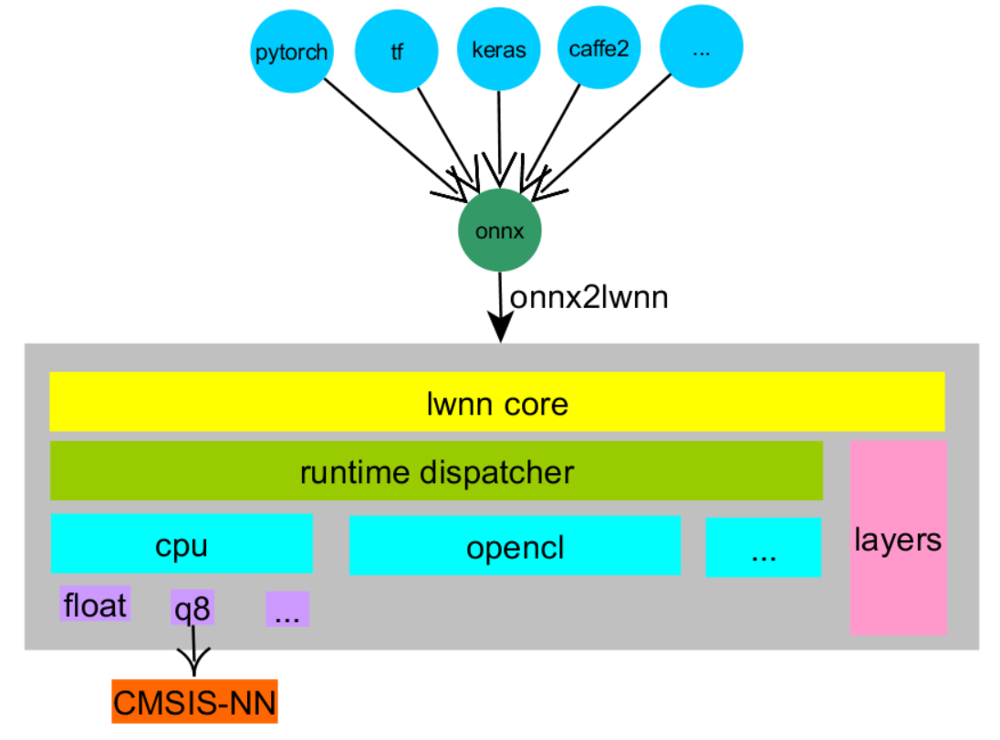

# LWNN - Lightweight Neural Network

[](https://travis-ci.org/lwnn/lwnn)

Mostly, inspired by [NNOM](https://github.com/majianjia/nnom), [CMSIS-NN](https://github.com/ARM-software/CMSIS_5/tree/develop/CMSIS/NN), I want to do something for Edge AI.

But as I think NNOM is not well designed for different runtime, CPU/DSP/GPU/NPU etc, it doesn't have a clear path to handle different type of runtime, and nowdays, I really want to study somehing about OpenCL, and I came across [MACE](https://github.com/XiaoMi/mace/tree/master/mace/ops/opencl/cl), and I find there is a bunch of CL kernels can be used directly.

So I decieded to do something meaningfull, do some study of OpenCL and at the meantime to create a Lightweight Neural Network that can be suitale for decices such as PC, mobiles and MCU etc.

## Architecture

And for the purpose to support variant Deep Learning frameworks such as tensorflow/keras/caffe2, pytorch etc, the [onnx](https://onnx.ai/) will be supported by lwnn, also for some old frameworks such as caffe/darknet that doesn't support onnx, they are supported by special handling.



| Layers/Runtime | cpu float | cpu s8 | cpu q8 | cpu q16 | opencl | comments |
| - | - | - | - | - | - | - |
| Conv1D | Y | Y | Y | Y | Y | based on Conv2D |
| Conv2D | Y | Y | Y | Y | Y | |
| DeConv2D | Y | Y | Y | Y | Y | |
| DepthwiseConv2D | Y | Y | Y | Y | Y | |
| DilatedConv2D | Y | N | N | N | Y | |
| EltmentWise Max | Y | Y | Y | Y | Y | |
| ReLU | Y | Y | Y | Y | Y | |
| PReLU | Y | N | N | N | Y | |
| MaxPool1D | Y | Y | Y | Y | Y | based on MaxPool2D |
| MaxPool2D | Y | Y | Y | Y | Y | |
| Dense | Y | Y | Y | Y | Y | |
| Softmax | Y | Y | Y | Y | Y | |
| Reshape | Y | Y | Y | Y | Y | |
| Pad | Y | Y | Y | Y | Y | |
| BatchNorm | Y | Y | Y | Y | Y | |
| Concat | Y | Y | Y | Y | Y | |
| AvgPool1D | Y | Y | Y | Y | Y | based on AvgPool2D |
| AvgPool2D | Y | Y | Y | Y | Y | |
| Add | Y | Y | Y | Y | Y | |
| PriorBox | Y | N | N | N | F | |
| DetectionOutput | Y | F | F | F | F | |
| Upsample | Y | Y | Y | Y | Y | |
| Yolo | Y | F | F | F | F | |
| YoloOutput | Y | F | F | F | F | |
| Mfcc | Y | F | F | F | F | |
| LSTM | Y | N | N | N | F | |

* F means fallback to others runtime that supported that layer.

* s8/q8/q16: all are in Q Format
* s8: 8 bit symmetric quantization with zero offset, very similar to [tflite quantization](https://github.com/tensorflow/tensorflow/blob/master/tensorflow/lite/g3doc/performance/quantization_spec.md)

* q8/q16: 8/16 bit symmetric quantization, no zero offset.

## Supported Famous Models

* [MobileNet-SSD](https://github.com/chuanqi305/MobileNet-SSD) : [README](gtest/models/ssd/README.md)

* [YOLOv3](https://github.com/pjreddie/darknet) : [README](gtest/models/yolov3/README.md)

* [ENET](https://github.com/TimoSaemann/ENet) : [README](gtest/models/enet/README.md)

* [DeepSpeech](https://github.com/mozilla/DeepSpeech) : [README](gtest/models/deepspeech/README.md)

Below is a list of command to run above models on OPENCL or CPU runtime.

```sh
# objection detection
lwnn_gtest --gtest_filter=*CL*SSDFloat -i images/dog.jpg
lwnn_gtest --gtest_filter=*CPU*SSDFloat -i images/dog.jpg
lwnn_gtest --gtest_filter=*CL*YOLOV3Float -i images/dog.jpg
lwnn_gtest --gtest_filter=*CPU*YOLOV3Float -i images/dog.jpg
# semantic segmentation
lwnn_gtest --gtest_filter=*CL*ENETFloat -i ENet/example_image/munich_000000_000019_leftImg8bit.png
lwnn_gtest --gtest_filter=*CPU*ENETFloat -i ENet/example_image/munich_000000_000019_leftImg8bit.png
# speech to text
lwnn_gtest --gtest_filter=*CPU*DSFloat -i speech_dataset/bird/042ea76c_nohash_0.wav
stt 49/29:                                 b  irr  d
```

Note: Those models has big accuracy drop when do quantization, I think quantization awareness training or something like TensorRT calibration is necessary.

## Development

### prepare environment
```sh
conda create -n lwnn python=3.6
source activate lwnn
conda install scons 
pip install tensorflow keras keras2onnx onnxruntime
sudo apt install nvidia-opencl-dev
```

### build

```sh
scons
```
